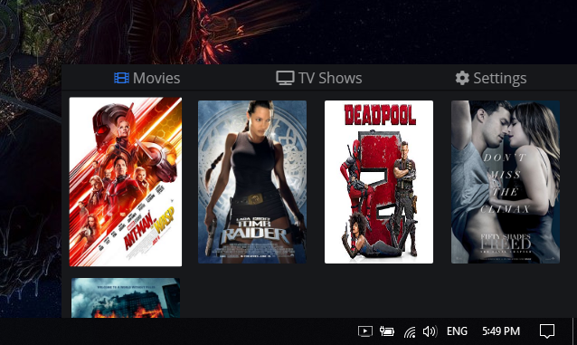
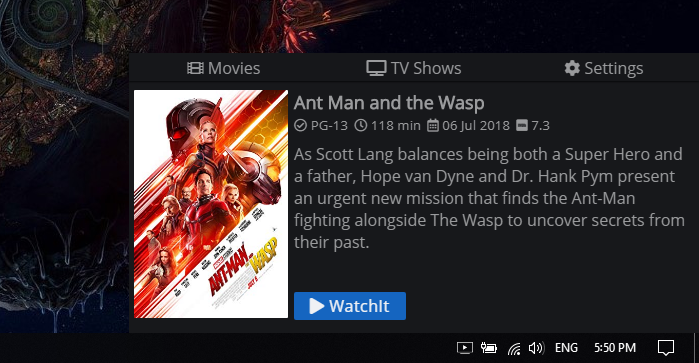

#  

WatchIT desktop client helps you manage movies and tv shows you like to stream on you mobile device.

[Download WatchIT Desktop](https://github.com/tsvetilian-ty/WatchIt-Desktop-Client/releases) | [WatchIT Server](https://github.com/tsvetilian-ty/WatchIt-Server/) | [Android Client](https://github.com/tsvetilian-ty/WatchIt-Android-Client)

## Contents

- [Usage](#usage)
- [Build](#build)
- [Supported formats](#supported-formats)
- [User guide](#user-guide)
- [Screenshots](#screenshots)
- [License](LICENSE.md)

## Usage

Install dependencies:

```console
$ npm install
```

Run the app:

```console
$ npm start
```

[GIST WITH PUBLIC VIDEOS FOR TEST](https://gist.github.com/jsturgis/3b19447b304616f18657)

## Build

To package the application:

```console
$ npm run package
```
#
To build the application:

```console
$ npm run make
```
## Supported formats

At the moment WatchIt supports: '.mkv', '.mp4', '.webm', '.TS', '.flv'

## User guide
 * **Installation destination on Windows** - %USERPROFILE%\AppData\Local\WatchIt if you want to add a shortcut
 * **Directory structure** - will automaticly check your directory structure and will create WatchIT Folder in your USER_DIR
    - **Add Movie** - Open the 'WatchIT' directory > Movies > Folder with the name of the movie with **_** as word separator (Example: Tomb_Raider) > the video file with [supported extention](#supported-formats)
    - **Add TV Show** - Open the 'WatchIT' directory > TV_Shows > Folder with the name of the show (**_** as word separator) > Folder with the season (**_** as word separator) > Folder with the episode (**_** as word separator) > the video file with [supported extention](#supported-formats)

## Screenshots

Non of the movies shown on the screenshots below are the "real" movies! 
We use movies with public access from [this gist](https://gist.github.com/jsturgis/3b19447b304616f18657), the calls to [OMDb API](http://www.omdbapi.com/) are build based on [directory structure](#user-guide) not the video file itself! 




